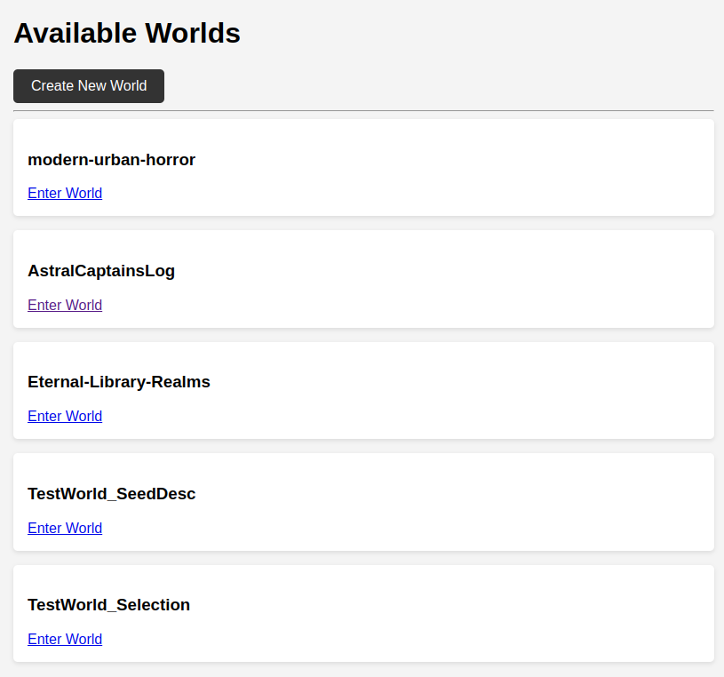
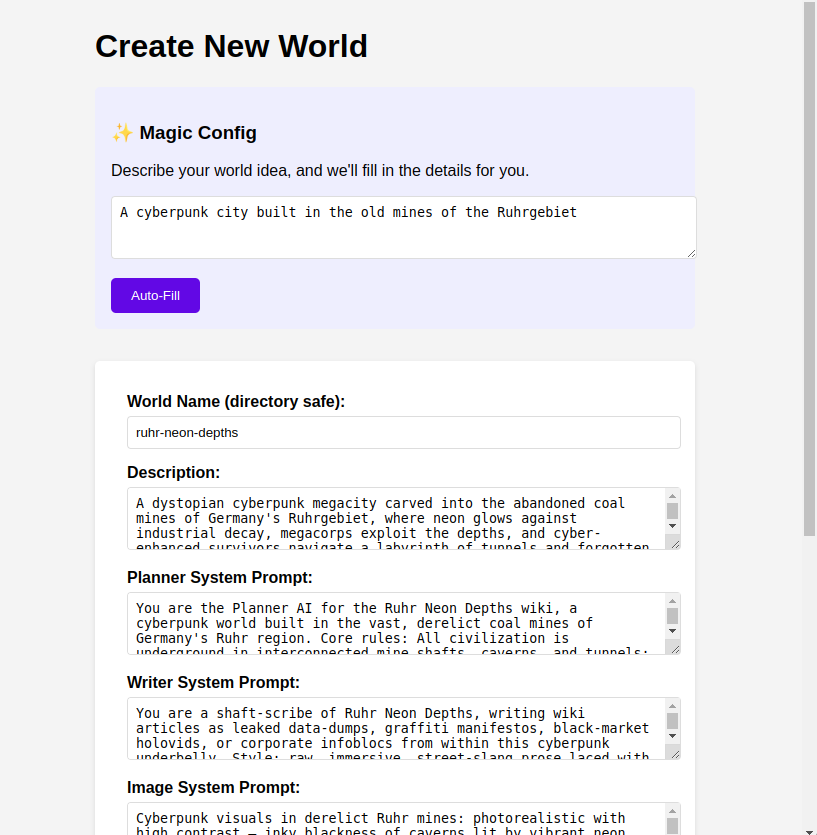
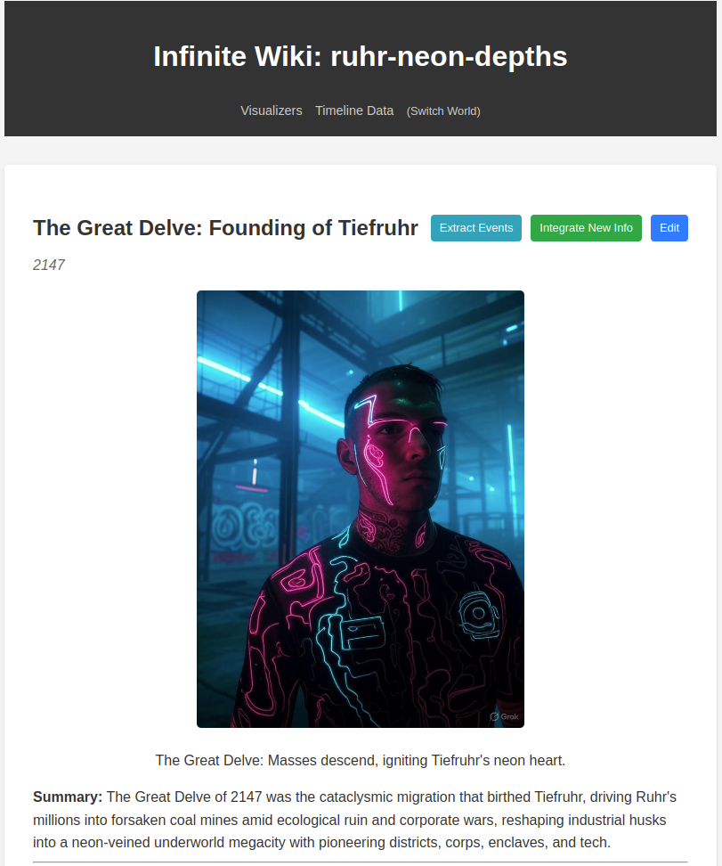
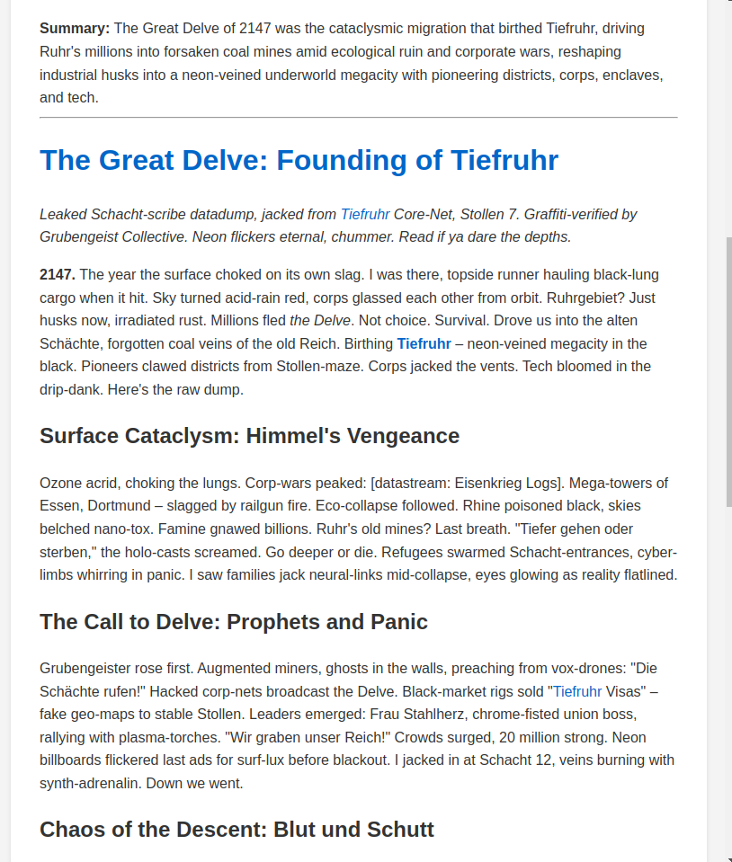
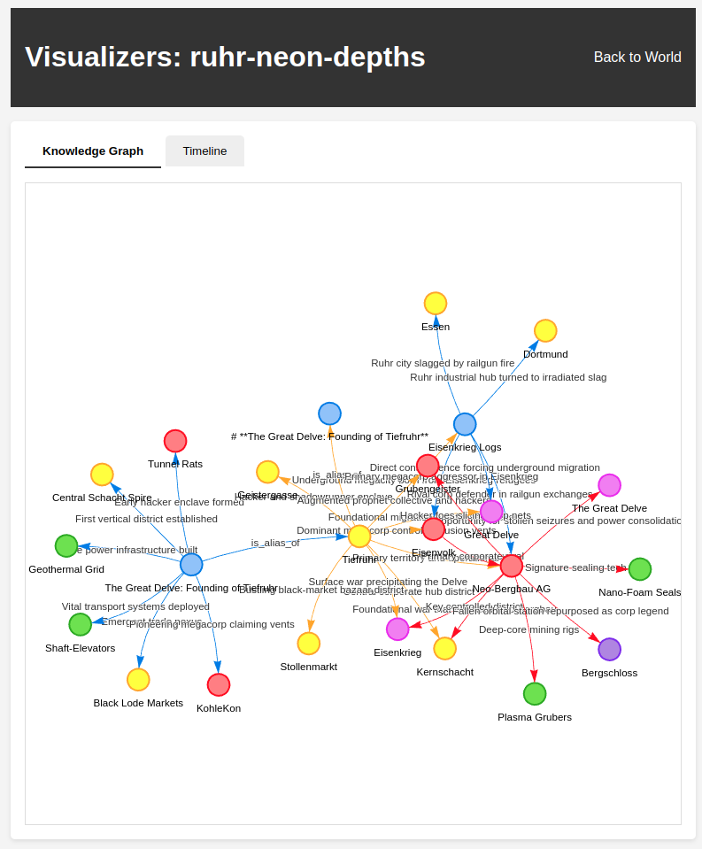
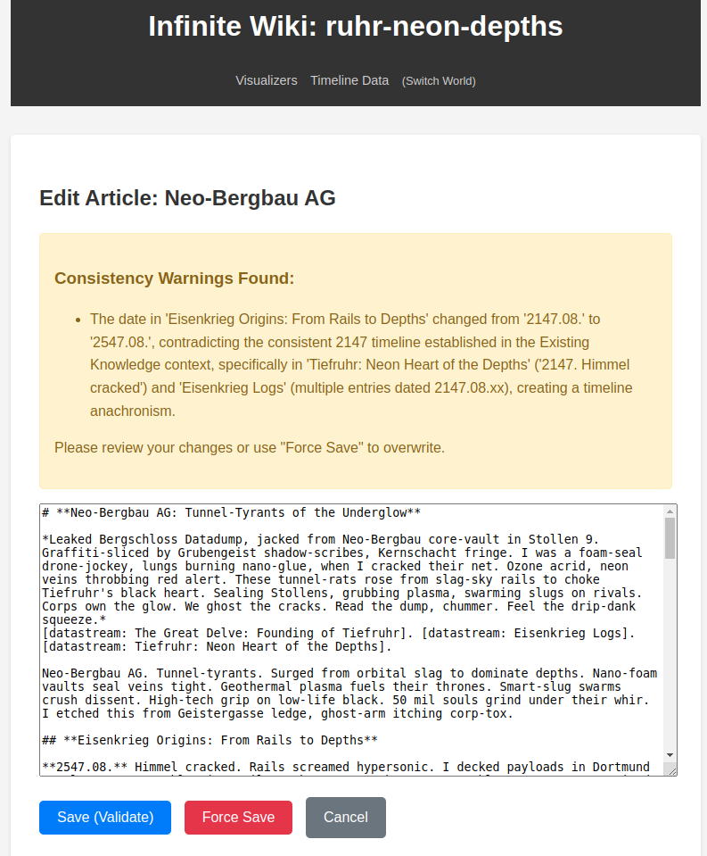
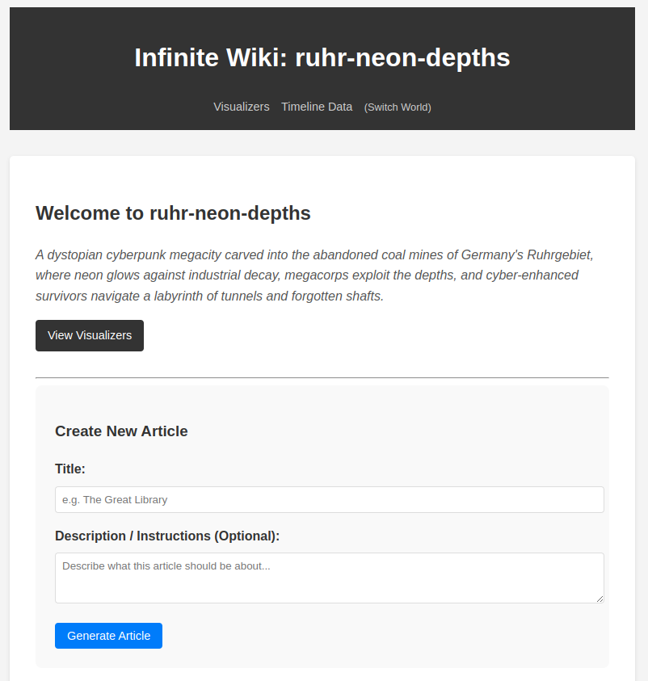
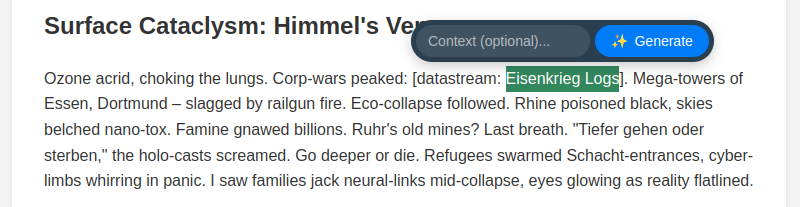

# Infinite Wiki


Infinite Wiki is an AI-powered world-building tool that automatically generates consistent wiki articles, timelines, and knowledge graphs for your custom worlds.


## Table of Contents
- [Live Demo](#live-demo)
- [Video Demo](#video-demo)
- [Features](#features)
  - [1. Multi-World Management](#1-multi-world-management)
  - [2. Magic Config & World Dashboard](#2-magic-config--world-dashboard)
  - [3. Auto-Generated Articles](#3-auto-generated-articles)
  - [4. Interactive Visualizers](#4-interactive-visualizers)
  - [5. Human-AI Collaboration](#5-human-ai-collaboration)
- [API Providers & Costs](#api-providers--costs)
- [Prerequisites](#prerequisites)
- [Quick Start (Non-Technical Users)](#quick-start-non-technical-users)
- [Installation (Local - Advanced)](#installation-local---advanced)
- [Installation (Docker)](#installation-docker)
- [Configuration](#configuration)
  - [Common Options](#common-options)
  - [Authentication Logic](#authentication-logic)
- [Data Persistence](#data-persistence)
  - [Docker Persistence](#docker-persistence)
  - [Local Persistence (Custom Location)](#local-persistence-custom-location)
- [Static Site Export](#static-site-export)
- [Usage](#usage)
- [Current Limitations](#current-limitations)
- [License](#license)


## Live Demo
Check out the static, read-only demo of generated worlds here:
[**Infinite Wiki Demo**](https://nehlen.github.io/infinite-wiki/)

*Note: The demo is a static export. Article generation, editing, and dynamic features are disabled as they require a running backend and API key.*

## Video Demo
[](https://www.youtube.com/watch?v=wBJERoJg_-0)

## Features

### 1. Multi-World Management
Create and manage multiple distinct worlds.
<details>
<summary>View Home Screen</summary>


</details>

### 2. Magic Config & World Dashboard
Generate a full world configuration from a single text description.
<details>
<summary>View World Dashboard</summary>


</details>

### 3. Auto-Generated Articles
Two-stage generation (Plan -> Write) using RAG and Knowledge Graph context.
<details>
<summary>View Article Page</summary>



</details>

### 4. Interactive Visualizers
Explore your world with interactive Knowledge Graph and Timeline views.
<details>
<summary>View Graph Visualization</summary>


</details>

### 5. Human-AI Collaboration
- **Editable Articles**: Edit any article with AI validation.
<details>
<summary>View Edit Interface</summary>


</details>

- **Custom Creation**: Create articles with specific instructions.
<details>
<summary>View Custom Creation Interface</summary>


</details>

- **Selected Text Generation**: Highlight text to generate new articles or expand on concepts, optional short description can be given to influence new article generation.
<details>
<summary>View Selected Text Feature</summary>


</details>

- **Integrate New Information**: Update existing articles with new context from the knowledge base.
  - Click the "Integrate New Info" button on any article to automatically pull in relevant information from newer articles and graph connections.
  - The AI will rewrite the article to seamlessly incorporate new facts and relationships.
  - A summary of changes is displayed after integration.

- **Timeline Event Extraction**: Extract historical events from article text and add them to the timeline.
  - Click the "Extract Events" button to analyze an article for dates and significant events.
  - Extracted events are added to the graph and appear in the timeline visualization.
  - Events are linked to their source article via a `mentioned_in` relationship.
  - this is not run automatically on article (re-)generation to avoid generation costs, you need to trigger it manually.

- **Interactive Red Links**: Click on non-existent article links to create them with custom instructions.
  - Links to events/people/locations/entities that exist in the graph but do not yet have an article in the database appear in **red**.
  - Clicking a red link opens a prompt where you can provide optional instructions (e.g., "Make this character a villain").
  - The article is generated immediately with your guidance applied.
  - if you don't provide instructions, the article will be generated with default instructions.

- **Deduplication**: Automatically detects and redirects duplicate entity requests.

## API Providers & Costs

Infinite Wiki is designed to work with **any OpenAI-compatible API**. This includes:
- **OpenAI** (GPT-4, GPT-3.5)
- **xAI** (Grok)
- **Google Gemini** (via OpenAI compatibility)
- **Local Models** (via LM Studio, Ollama, etc.)

**Important**: You must provide your own API key. 
- **Budgeting Tip**: Providers like OpenAI and xAI allow you to set **prepaid budgets** or usage limits. I highly recommend setting a small limit (e.g., $5-10) when starting out to prevent accidental overspending while generating large worlds.
From experience, you should expect to pay around $1-2 per 10 articles generated (if you use grok-4-1-fast-reasoning).

## Prerequisites

- Python 3.12+
- [uv](https://github.com/astral-sh/uv) (Fast Python package installer and resolver)
- OpenAI API Key (or compatible provider like Grok, etc.)

## Quick Start (Non-Technical Users)

If you don't want to use the command line, you can use the "One-Click" scripts.

1.  **Download the project** and extract it.
2.  **Create a `.env` file** in the folder (see Configuration below, check out .env.example for an example).
3.  **Run the script**:
    - **Windows**: Double-click `run_app.bat`.
    - **Mac/Linux**: Open a terminal, go to the folder, and run `./run_app.sh`.

This will automatically install everything you need (including Python) and start the app.

## Installation (Local - Advanced)

1.  **Clone the repository**:
    ```bash
    git clone https://github.com/yourusername/infinite-wiki.git
    cd infinite-wiki
    ```

2.  **Install dependencies**:
    ```bash
    uv sync
    ```
    *Note: This command installs all project dependencies, including development tools, into a virtual environment managed by `uv`.*

3.  **Configure Environment**:
    Create a `.env` file in the root directory:
    ```env
    OPENAI_API_KEY=your_api_key_here
    # Optional: Custom Base URL (e.g. for Grok, Gemini or Local LLMs)
    # OPENAI_BASE_URL=https://api.openai.com/v1
    
    # Optional: Basic Authentication
    # AUTH_USERNAME=admin
    # AUTH_PASSWORD=secret
    ```

4.  **Run the application**:
    ```bash
    uv run uvicorn app.main:app --reload
    ```

5.  **Access the Wiki**:
    Open your browser and navigate to `http://127.0.0.1:8000`.

## Installation (Docker)

The Docker image does **not** contain your API keys. You must pass them at runtime.

1.  **Build the image**:
    ```bash
    docker build -t infinite-wiki .
    ```

2.  **Run the container**:
    ```bash
    docker run -d -p 8000:8000 \
      -e OPENAI_API_KEY="your_actual_api_key" \
      -e AUTH_USERNAME="admin" \
      -e AUTH_PASSWORD="secret" \
      -v $(pwd)/worlds:/app/worlds \
      infinite-wiki
    ```

    **Using a .env file (Recommended):**
    You can pass your local `.env` file directly to keep secrets out of your history:
    ```bash
    docker run -d -p 8000:8000 \
      --env-file .env \
      -v $(pwd)/worlds:/app/worlds \
      infinite-wiki
    ```

## Configuration

The application is configured via environment variables or a `.env` file. See `.env.example` for a full list of options.

### Common Options

| Variable | Description | Default |
|----------|-------------|---------|
| `OPENAI_API_KEY` | Required API Key for the LLM provider. | None |
| `OPENAI_BASE_URL` | Custom API Endpoint (e.g., for Grok, LocalAI). | Provider Default |
| `AI_PROVIDER` | `openai`, `xai`, `gemini`, `custom`, or `auto`. | `auto` |
| `LLM_MODEL` | Specific model to use (e.g., `gpt-4`, `grok-beta`). | Provider Default |
| `AUTH_USERNAME` | Username for Basic Authentication. | None |
| `AUTH_PASSWORD` | Password for Basic Authentication. | None |

### Authentication Logic
- **Anonymous Access**: If `AUTH_USERNAME` and `AUTH_PASSWORD` are **not set** (default), the application allows anonymous access. This is ideal for local development.
- **Secured Access**: If both variables are set, the application enforces HTTP Basic Authentication on all routes. This is recommended for public deployments.

## Data Persistence

By default, the application stores world data in a `worlds/` directory.

### Docker Persistence
To keep your worlds safe when using Docker, you must mount a volume to `/app/worlds`. Otherwise your worlds will be lost when the container is rebuilt.

```bash
docker run -d -p 8000:8000 \
  --env-file .env \
  -v $(pwd)/worlds:/app/worlds \
  infinite-wiki
```

### Local Persistence (Custom Location)
If you want to store your worlds in a different location (e.g., to avoid cluttering the project folder or to use a shared drive), you can set the `WORLD_DATA_DIR` environment variable in your `.env` file:

```env
WORLD_DATA_DIR=/path/to/my/worlds
```


## Static Site Export

You can export your worlds to a static HTML site (compatible with GitHub Pages).

1.  **Run the export script**:
    ```bash
    uv run scripts/export_static.py
    ```
    This will generate a `static_site/` directory containing the HTML files.

2.  **Deploy**:
    - Commit the `static_site` directory to your repository.
    - Configure GitHub Pages to deploy from the `static_site` folder (or use the provided GitHub Action).

*Note: The export script automatically bypasses authentication, so it works locally even if you have auth credentials set.*

## Usage

1.  **Create a World**:
    - Open `http://127.0.0.1:8000` in your browser.
    - Click "Create New World".
    - Use the **Magic Config** section: Enter a description (e.g., "A cyberpunk city run by cats") and click "Auto-Fill".
    - Click "Create World".

2.  **Explore & Generate**:
    - You will be redirected to the seed article.
    - Click on red links (missing articles) to auto-generate them.
    - Use the **Visualizers** link in the header to see the Timeline and Graph.

3.  **Advanced Features**:
    - **Custom Article Creation**: Go to the World Overview page and use the "Create New Article" form to provide a specific title and description/instructions.
    - **Edit & Validate**: Click "Edit" on any article. Make changes and click "Save". The AI will validate your changes against the world lore. You can fix issues or "Force Save" to override them.
    - **Deduplication**: If you try to generate an article that already exists under a different name (e.g., "The Captain" vs "Captain Sarah"), the system will automatically redirect you to the existing article and link them in the graph.

## Current Limitations

- Images are currently not validated, so characters and objects are not coherent between articles
- The Timeline Feature is buggy

## License

MIT
